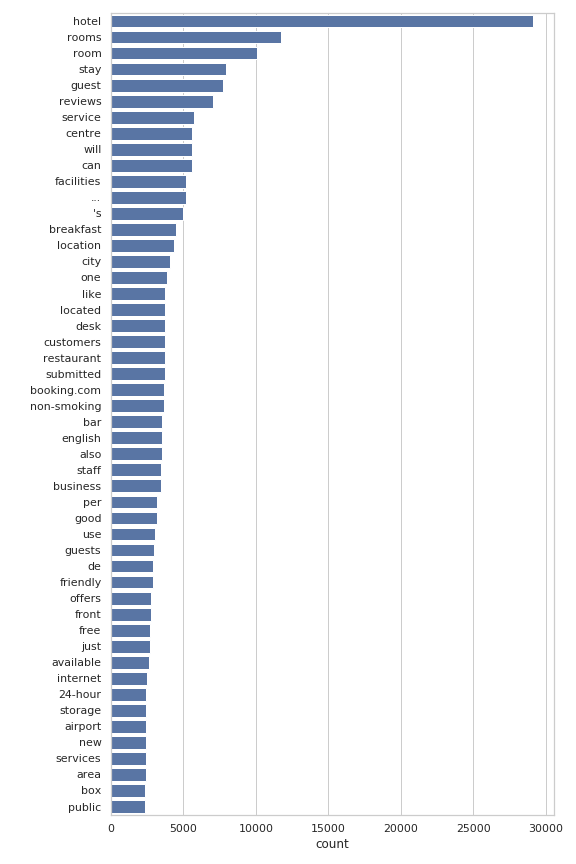

# Project description

## Table of contents

1. [Project Proposal](#project-proposal)
2. [Data Analysis](#data-analysis)
3. [Architecture](#model-architecture)
4. [Training routine](#training-routine)

## Project Proposal

### Motivation

We will be solving the task of machine translation between natural languages.
It is arguably the most widely applied and researched natural language processing task in practice today.

Translating long sentences is one of the common problems that neural machine translation models can be facing.
When using a recurrent architecture, the model often tends to forget the beginning of the sentence before it finishes processing it to the end.
This has been first partly solved by the invention of the LSTM and the GRU, both of which implements a forget gate – a part of the cell which selectively drops remembered information that it deems not useful, so it can remember more of the necessary information.

A popular method for translating sentences today is transforming the input sequence into a feature vector using an encoder network and then decoding it into a sentence in another language using another network.
However this solution is far from perfect for translating very long sentences, as the entire sentence has to be embedded into a single fixed-length vector.
Currently, many of the state-of-the-art methods implement an attention mechanism which trains the model to pay selective attention to each step of the input sequence [[source]](https://machinelearningmastery.com/attention-long-short-term-memory-recurrent-neural-networks/).

### Related Work

Proposal of the encoder–decoder model:

* [Sutskever, I. et al.: Sequence to Sequence Learning with Neural Networks. *arXiv*. 2014.](http://papers.nips.cc/paper/5346-sequence-to-sequence-learning-with-neural-networks.pdf)

Proposal of the attention mechanism:

* [Bahdanau, D. et al.: Neural Machine Translation by Jointly Learning to Align and Translate. *arXiv*. 2017.](https://arxiv.org/pdf/1409.0473.pdf)

Proposal of the Transformer – a model that completely abandons recurrence and convolution in favor of attention:

* [VASWANI, A. et al.: Attention Is All You Need. *arXiv*. 2017.](https://arxiv.org/pdf/1706.03762v5.pdf)

### Dataset

We will be using the [_WMT'15_ English–Czech dataset](https://nlp.stanford.edu/projects/nmt/) provided by the _The Stanford Natural Language Processing Group_.

It contains 15,794,564 pairs of tokenized sentences in English and Czech.

### Proposed Solution

We will attempt to create a solution using a recurrent encoder–decoder model.

As an experiment, we will compare different recurrent architectures, such as a standard RNN and an LSTM or a GRU, against a baseline solution.

## Data Analysis

### Dataset Description

We chose previously mentioned dataset in the section of project proposal as our final dataset, which we used for an
analysis and training, as well as validation of prototyped models. Dataset is split into train and test data and for
every language there are separate files, meaning the dataset consists of four files total. Each file contains one
sentence per line, while translation pairs share the same line index.

Since the sentences were already cleansed and tokenized, there was no need for us to do additional pre-processing.
Punctuation characters are represented by stand-alone tokens (`"["` or `"..."`) and tokens can also contain both
lowercase and uppercase characters resulting in different tokens for the same word, eg. `"Text"` and `"text"`.

For easier work with dataset due to it's size we have built our own module dedicated to loading the data:
`nn_project/data.py`.

### Analysis

Because we are trying for a machine translation, there is not much statistical analysis we can do regarding our obtained
dataset. Since we can understand both translated languages, english and czech, we decided to at least compare
similarities between the translated data.

For visual comparison of both languages we used histogram visualizing the word count of most common words
and word cloud showing the most common two-grams and words.

For demonstration we worked with first 100 000 samples of training data.

#### Histogram

At first we created a histogram from english data of 50 most common words. As we suspected, the data contained too much
punctuation tokens demonstrated by first and third most common token. Also plot contained certain types of parts
of speech like articles, that do not translate well into other languages.

After seeing the results of fist figure, we removed [stopwords](https://pypi.org/project/stop-words/), which left us 
with words more fitting for translation comparison. We also removed punctuation tokens by removing all tokens
with length 1 and the result was satisfying enough:

We decided to create a histogram of czech words in the same fashion using czech stopwords:

Even before analyzing czech we previously noticed, that the czech data contains a lot of english words and even the
whole sentences. It is caused by multiple factors. Either by a multiple international words originating form english.
Second there occur to be signs, titles and phrases in original english form nested in sentences. Also
the dataset contains multiple sentences explaining a translation, therefore there happen to be both english and
czech words in one sentence.

Because we removed only czech stopwords in previous step the created plot showed multiple english words, mostly
stopwords. We solved this situation by including english stopwords too:

#### Word Cloud

As word cloud creation tool we used [word cloud generator](https://github.com/amueller/word_cloud) for Python. The word
clouds are created with maximum of 200 words and we use the same filtering techniques (stopwords and token length) as
in histograms.

English word cloud:

Czech word cloud:

Czech word cloud without english stopwords:

We concluded that the translations are similar enough, at least in a scope of most common words, although it can only
mean, that original corpus of dataset deals with the same topic.

## Model Architecture

### Vocabulary

### Padding

### Encoder-Decoder model

As a solution for aur machine transation problem, we proposed encoder-decoder neural network architecture, which
consists of two connected recurrent neural networks. This architecture excels at converting input sequences into
output sequences. In out dataset the sentences in certain language represent input sequence for our model and output
should be translated sentence, or at least it's representation. This task is more than fitting for encoder-decoder
model.

Our encoder-decoder model consists of 5 layers: Embedding (Dense), Encoder (RNN), Repeater, Decoder(RNN) and Dense.

**Glossary:**

* `batch size` - number of samples fed to model during one step of training
* `sentence length` - maximal word count in one sentence in original dataset (number of sequence time steps)
* `embedding size` - size of vector representing one word
* `context vector size` - size of thought vector representing meaning of sentence; equals to number of units in encoder
* `translation length` - maximal word count in one sentence in translated dataset (number of sequence time steps); variable?
* `decoder units count` - TODO
* `vocabulary size` - number of words contained in vocabulary

#### Embedding

Embedding layers are basically dense layers, that help us to project words into n-dimensional space, where distances
between word vectors represent semantic similarity and words with similar words tend to be located in the same clusters.
Encoding words in such vectors for translation can help with problems like identifying gender or generally meaning
of unknown word.

Usually the range of dimension size used for embeddings is between 100 to 300.  

**Input:** `[<batch size>, <sentence length>]`

**Output:** `[<batch size>, <sentence length>, <embedding size>]`

#### Encoder

Encoder is neural network consisting of recurrent units processing feed as many-to-one. For our purposes we
implemented a choice to use basic RNN, GRU or LSTM as internal units.

Based on incoming sequence of words, in our case word vectors generated by embedding, encoder encodes those sequences
into internal state for every time step (word) in sequence. After reading the whole input a context vector is
generated as it's output, which represents the meaning of a whole sentence.

The number of units in encoder define the size of context vector.

**Input:** `[<batch size>, <sentence length>, <embedding size>]`

**Output:** `[<batch size>, <context vector size>]`

#### Context Vector Repeater

Since we need to generate a whole new sequence and we only get one output vector from encoder, we need to create
sequence of context vectors, that is fed to decoder. We accomplish this by repeating the last context vector up to
n-times, where the maximal length of output sequence according to word count in translated data.

**Input:** `[<batch size>, <context vector size>]`

**Output:** `[<batch size>, <translation length>, <context vector size>]`

#### Decoder

Decoder is recurrent neural layer processing input as many-to-many. For our purposes we
implemented a choice to use basic RNN, GRU or LSTM as internal units, same as encoder.

For every context vector fed to decoder it generates decoder vector with size corresponding to number of recurrent
units. Decoder vectors represent one word as a vector. In a way, it is really similar to those in embeddings.

**Input:** `[<batch size>, <translation length>, <context vector size>]`

**Output:** `[<batch size>, <translation length>, <decoder units count>]`

#### Dense

In order to transform decoder vector into words, we need to train dense layer to accomplish this. The purpose of it
is to categorize decoder vector as one of words in a vocab using the softmax activation function.

Dense layer works a a classifier, therefore the number of hidden units has to be equal to vocabulary size in order
for classification to be accurate.

**Input:** `[<batch size>, <translation length>, <decoder units count>]`

**Output:** `[<batch size>, <translation length>, <vocabulary size>]`

## Training Routine

## Results

## Room for Improvement
