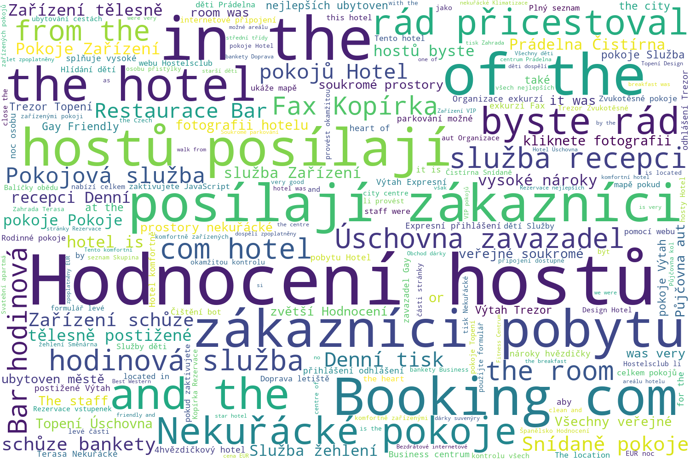

# Project Proposal

## Motivation

We will be solving the task of machine translation between natural languages.
It is arguably the most widely applied and researched natural language processing task in practice today.

Translating long sentences is one of the common problems that neural machine translation models can be facing.
When using a recurrent architecture, the model often tends to forget the beginning of the sentence before it finishes processing it to the end.
This has been first partly solved by the invention of the LSTM and the GRU, both of which implements a forget gate – a part of the cell which selectively drops remembered information that it deems not useful, so it can remember more of the necessary information.

A popular method for translating sentences today is transforming the input sequence into a feature vector using an encoder network and then decoding it into a sentence in another language using another network.
However this solution is far from perfect for translating very long sentences, as the entire sentence has to be embedded into a single fixed-length vector.
Currently, many of the state-of-the-art methods implement an attention mechanism which trains the model to pay selective attention to each step of the input sequence [[source]](https://machinelearningmastery.com/attention-long-short-term-memory-recurrent-neural-networks/).

## Related Work

Proposal of the encoder–decoder model:

* [Sutskever, I. et al.: Sequence to Sequence Learning with Neural Networks. *arXiv*. 2014.](https://arxiv.org/pdf/1706.03762v5.pdf)

Proposal of the attention mechanism:

* [Bahdanau, D. et al.: Neural Machine Translation by Jointly Learning to Align and Translate. *arXiv*. 2017.](https://arxiv.org/pdf/1706.03762v5.pdf)

Proposal of the Transformer – a model that completely abandons recurrence and convolution in favor of attention:

* [VASWANI, A. et al.: Attention Is All You Need. *arXiv*. 2017.](https://arxiv.org/pdf/1706.03762v5.pdf)

## Dataset

We will be using the [_WMT'15_ English–Czech dataset](https://nlp.stanford.edu/projects/nmt/) provided by the _The Stanford Natural Language Processing Group_.

It contains 15,794,564 pairs of tokenized sentences in English and Czech.

## Proposed Solution

We will attempt to create a solution using a recurrent encoder–decoder model.

As an experiment, we will compare different recurrent architectures, such as a standard RNN and an LSTM or a GRU, against a baseline solution.

# Data Analysis

## Dataset Description

We chose previously mentioned dataset in the section of project proposal as our final dataset, which we used for an
analysis and training, as well as validation of prototyped models. Dataset is split into train and test data and for
every language there are separate files, meaning the dataset consists of four files total. Each file contains one
sentence per line, while translation pairs share the same line index.

Since the sentences were already cleansed and tokenized, there was no need for us to do additional pre-processing.
Punctuation characters are represented by stand-alone tokens (`"["` or `"..."`) and tokens can also contain both
lowercase and uppercase characters resulting in different tokens for the same word, eg. `"Text"` and `"text"`.

For easier work with dataset due to it's size we have built our own module dedicated to loading the data:
`nn_project/data.py`.

## Analysis

Because we are trying for a machine translation, there is not much statistical analysis we can do regarding our obtained
dataset. Since we can understand both translated languages, english and czech, we decided to at least compare
similarities between the translated data.

For visual comparison of both languages we used histogram visualizing the word count of most common words
and word cloud showing the most common two-grams and words.

For demonstration we worked with first 100 000 samples of training data.

### Histogram

At first we created a histogram from english data of 50 most common words. As we suspected, the data contained too much
punctuation tokens demonstrated by first and third most common token. Also plot contained certain types of parts
of speech like articles, that do not translate well into other languages.

After seeing the results of fist figure, we removed stopwords, which left us with words more fitting for translation
comparison. We also removed punctuation tokens by removing all tokens with length 1 and the result was satisfying
enough:

We decided to create a histogram of czech words in the same fashion using czech stopwords:

Even before analyzing czech we previously noticed, that the czech data contains a lot of english words and even the
whole sentences. It is caused by multiple factors. Either by a multiple international words originating form english.
Second there occur to be signs, titles and phrases in original english form nested in sentences. Also
the dataset contains multiple sentences explaining a translation, therefore there happen to be both english and
czech words in one sentence.

Because we removed only czech stopwords in previous step the created plot showed multiple english words, mostly
stopwords. We solved this situation by including english stopwords too:

### Word Cloud

As word cloud creation tool we used [word cloud generator](https://github.com/amueller/word_cloud) for Python. The word
clouds are created with maximum of 200 words and we use the same filtering techniques (stopwords and token length) as
in histograms.

English word cloud:

Czech word cloud:

Czech word cloud without english stopwords:

We concluded that the translations are similar enough, at least in a scope of most common words, although it can only
mean, that original corpus of dataset deals with the same topic.
